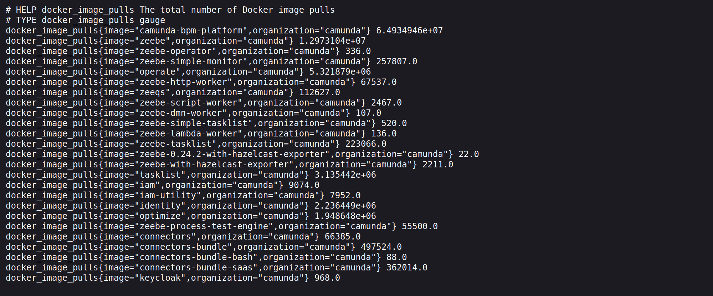

# Eliud Njenga - Infrastructure Coding Challenge (DockerHub stats exporter)
---
## Overview
This Prometheus Exporter is written in Python to return metric values for the count of Docker images pulls in a specified DockerHub organization. The exporter runs on port 2113 and provides metrics on the /metrics endpoint.

## Prerequisites
Ensure you have the following tools installed and configured on your machine:

    Docker: 25.0.0+
    kubectl: 1.29+
    kind: 0.21.0+ (using Kubernetes cluster v1.29)
    bash: 4.2+
    curl: 8.6.0+

## Installation
To run this application, make use of the included makefiles with each file and its purpose described below.
## Makefile

The main entry point to invoke different commands from the test framework:

- **make build**: Builds the app and pushes the docker image to local _kind_ registry
- **make check**: Checks all required tools are installed
- **make create**: Creates local kind cluster
- **make deploy**: Deploys the app
- **make full-test**: Runs the full testing suite
- **make help**: This help
- **make lint**: Runs linters, check missing TODOs
- **make teardown**: Destroys local kind cluster and registry
- **make test**: Runs basic tests to check that the app works (in the kind cluster)
- **make test-local**: Runs basic tests to check that the app works (non-dockerized)
- **make run**: Runs the app locally (non-dockerized)

## Altertenative Approach

1. Clone the repository:
   ``` bash
   git clone https://github.com/Eliud-Ngorongo/prometheus-exporter
   cd prometheus exporter
   ```
2. Build docker image

   ```bash
   docker build -f app-python/Dockerfile -t prometheus_exporter .
   ```
3. Create Kind cluster
   ```bash
   kind create cluster
   ```
4. Load the newly built Docker image into the Kind cluster::
   ``` bash
   kind load docker-image prometheus_exporter:latest
   ```
5. Apply the Kubernetes manifests:
   ``` bash
   kubectl apply -f k8s-resources/
   ```
6. Check the status of deployed resources
   ```bash
   kubectl get pods
   kubectl get svc
   ```


After running the above command, you can access the metrics endpoint by running this endpont on your preferred browser:
```
    localhost:2113/metrics
``` 
 OR using your terminal with the command:
 ``` 
 curl http://localhost:2113/metrics
```
 The expected results will look somethings similar to this:
 


---
# Conclusion

With this straightforward Prometheus Exporter, you can efficiently monitor DockerHub image pulls for your organization with ease. The detailed guide simplifies the setup and deployment process within a local Kind Kubernetes cluster. Start tracking image usage today to optimize your container management strategies seamlessly.

# Contact
For any further questions or issues, please contact Eliud Njenga at eliudnjenga@gmail.com


A candidate does not need to touch this file.

## Feedback.md

A document for the candidates to leave us feedback.

## app-*

These are the directories where a candidate needs to place the code for their app 
(based on the language of their choice.)

## k8s-resources

Includes Kubernetes manifests for the app.

A candidate needs to place the manifests for deploying their app in the `app.yml` file.

## Scripts

Auxiliary scripts used by the `make` targets.

A candidate does not need to touch those.
A candidate normally does not need to run these directly.

- **_library.sh**: Library of the most-used reusable functions of the test framework
- **build-push-app.sh**: Builds the app Docker image and pushes it to the registry of the test cluster
- **check-installed-tools.sh**: Checks that the required utilities for the challenge are installed (e.g. Docker)
- **check-todos.sh**: Checks that the TODOs are fixed by the candidate
- **codestyle.sh**: Runs a linter for the app code
- **create-kind-cluster.sh**: Creates a test kind cluster with the name from `settings.sh`
- **delete-kind-cluster.sh**: Deletes a test kind cluster and its registry
- **deploy-app.sh**: Deploys the app app in the test cluster
- **parselog.sh**: Parses test log and outputs various stats on it
- **test-app.sh**: Tests the app behavior for different process creation rates.
